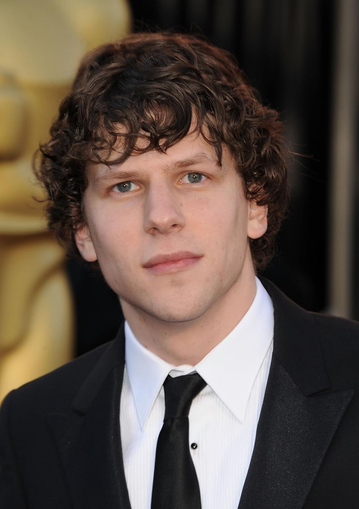

# Dakotah Haughey

My favorite movie would probably have to be Zombieland. It is a very classic zombie apocolypse movie, but has a good plot and is funny as well. It has a few good twists, and while it is thrilling, I consider it a comfort movie. I also like the actors in it and they play their roles very well.

---
### Different Actors

These are some different actors that I belive would play the main role in ZombieLand well. This table shows their name, why I chose them, and their age.

| Name | Why they'd do well | Age |
| :----------------: | :---------------------------- | :---: |
| Rami Malek | He fits the awkward personality of the character | 43 |
| Malissa McCarthy | She can do literally anything and is funny | 54 |
| Orlando Bloom | He would be awkward and funny in the role | 48 |
| Emma Stone | She could be all parts in the movie and it would be a banger | 36 |

